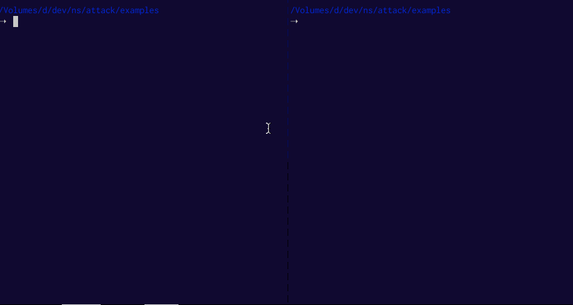

# attack [](http://travis-ci.org/thlorenz/attack)

Tool that surfaces problems in your application that render it insecure or may cause it to crash.



```js
// create sitemap of your server
var attack = require('thlorenz-attack')
var app = require('express')()
  .get('/', function index () { })
  .post('/other', function other () { })

attack.writeRoutes(app)
```

Then use the `attack` cli tool to generate **ab** and **siege** scripts to attack your server.

<!-- START doctoc generated TOC please keep comment here to allow auto update -->
<!-- DON'T EDIT THIS SECTION, INSTEAD RE-RUN doctoc TO UPDATE -->
**Table of Contents**  *generated with [DocToc](https://github.com/thlorenz/doctoc)*

- [Status](#status)
- [Installation](#installation)
- [Usage](#usage)
- [API](#api)
    - [attack::ab(root, routes, opts)](#attackabroot-routes-opts)
    - [attack::siege(root, routes, opts)](#attacksiegeroot-routes-opts)
    - [attack::writeRoutes(app, opts)](#attackwriteroutesapp-opts)
- [Examples](#examples)
  - [Express Example](#express-example)
- [License](#license)

<!-- END doctoc generated TOC please keep comment here to allow auto update -->

## Status

Only express apps supported at the moment to have sitemap geneated.

## Installation

    npm install thlorenz-attack

## Usage

```
usage: attack <attack-options>

Surfaces problems in your application that render it insecure or may cause it to crash.
Requires a routes file to have been generated, see https://github.com/thlorenz/attack#attackwriteroutesapp-opts

OPTIONS:

  -h, --help      Print this help message.
  -c, --config    Overrides the default configuration for siege and ab
                  The config file has this format:
                  https://github.com/thlorenz/attack/blob/master/attacks/default-config.json 
  -t, --type      Specifies which kind of attack to generate ('ab' | 'siege') 
  -u, --url       Specifies the root url at which your server accepts requests (including port and protocol)
                  i.e. http://localhost:5000
  -o, --output    Specifies into which file to pipe the output of the 'ab' tool  


EXAMPLES:

Create an ab attack using the default options piping into results.txt

  attack -r ./attack-routes.json -o results.txt -t ab -u http://localhost:5001 > attack.sh

Create a siege attack using the default options

	attack -r ./attack-routes.json -o results.txt -t siege -u http://localhost:5001 > siege-attack.sh &&\

Create a siege attack using a custom config

	attack -r ./attack-routes.json -c ./myconfig.json -o results.txt -t siege -u http://localhost:5001 > siege-attack.sh &&\

Find more examples in the examples/Makefile at https://github.com/thlorenz/attack/blob/master/examples/Makefile
```

The config you can pass looks as follows. It is best if you just copy it from
[here](https://github.com/thlorenz/attack/blob/master/attacks/default-config.json) and then modify it to your
liking.

```json
{
  "siege": {
    "acceptEncoding": "gzip",
    "authorization": null,
    "concurrency": 5,
    "internet": true,
    "keepAlive": true,
    "loginUrl": null,
    "requests": 20
  },
  "ab": {
    "authorization": null,
    "concurrency": 5,
    "jsonFiles": null, "//": "array of JSON file names to be used in Invalid JSON attack",
    "keepAlive": false,
    "requests": 50,
    "url": null,
    "resultFile": "ab-results.txt"
  }
}
```

## API


<!-- START docme generated API please keep comment here to allow auto update -->
<!-- DON'T EDIT THIS SECTION, INSTEAD RE-RUN docme TO UPDATE -->

<div>
<div class="jsdoc-githubify">
<section>
<article>
<div class="container-overview">
<dl class="details">
</dl>
</div>
<dl>
<dt>
<h4 class="name" id="attack::ab"><span class="type-signature"></span>attack::ab<span class="signature">(root, routes, <span class="optional">opts</span>)</span><span class="type-signature"></span></h4>
</dt>
<dd>
<div class="description">
<p>Generates a shell script that runs various <strong>ab</strong> commands in order to expose
ways that an application could be crashed.</p>
</div>
<h5>Parameters:</h5>
<table class="params">
<thead>
<tr>
<th>Name</th>
<th>Type</th>
<th>Argument</th>
<th class="last">Description</th>
</tr>
</thead>
<tbody>
<tr>
<td class="name"><code>root</code></td>
<td class="type">
<span class="param-type">String</span>
</td>
<td class="attributes">
</td>
<td class="description last"><p>root url of the server to attack, i.e. http://localhost:3000</p></td>
</tr>
<tr>
<td class="name"><code>routes</code></td>
<td class="type">
<span class="param-type">Array.&lt;Object></span>
</td>
<td class="attributes">
</td>
<td class="description last"><p>collected via @see ./lib/write-routes.js</p></td>
</tr>
<tr>
<td class="name"><code>opts</code></td>
<td class="type">
<span class="param-type">Object</span>
</td>
<td class="attributes">
&lt;optional><br>
</td>
<td class="description last"><p>options to tweak each attack</p>
<h6>Properties</h6>
<table class="params">
<thead>
<tr>
<th>Name</th>
<th>Type</th>
<th>Argument</th>
<th class="last">Description</th>
</tr>
</thead>
<tbody>
<tr>
<td class="name"><code>authorization</code></td>
<td class="type">
<span class="param-type">String</span>
</td>
<td class="attributes">
&lt;optional><br>
</td>
<td class="description last"><p>authorization string if required, i.e. 'Authorization: Token abcd1234'</p></td>
</tr>
<tr>
<td class="name"><code>concurrency</code></td>
<td class="type">
<span class="param-type">Number</span>
</td>
<td class="attributes">
&lt;optional><br>
</td>
<td class="description last"><p>how many requests to fire in parallel, default: 5</p></td>
</tr>
<tr>
<td class="name"><code>requests</code></td>
<td class="type">
<span class="param-type">Number</span>
</td>
<td class="attributes">
&lt;optional><br>
</td>
<td class="description last"><p>how many requests to fire, default: 50</p></td>
</tr>
<tr>
<td class="name"><code>url</code></td>
<td class="type">
<span class="param-type">String</span>
</td>
<td class="attributes">
</td>
<td class="description last"><p>url at which to fire the requests</p></td>
</tr>
<tr>
<td class="name"><code>resultFile</code></td>
<td class="type">
<span class="param-type">String</span>
</td>
<td class="attributes">
</td>
<td class="description last"><p>file to which ab results are piped</p></td>
</tr>
<tr>
<td class="name"><code>keepAlive</code></td>
<td class="type">
<span class="param-type">Boolean</span>
</td>
<td class="attributes">
&lt;optional><br>
</td>
<td class="description last"><p>if true keep-alive is configured for ab, default: <code>true</code></p></td>
</tr>
<tr>
<td class="name"><code>jsonFiles</code></td>
<td class="type">
<span class="param-type">Array.&lt;String>=</span>
</td>
<td class="attributes">
&lt;optional><br>
</td>
<td class="description last"><p>full paths to JSON files to use as tricky payloads on top of the ones included</p></td>
</tr>
</tbody>
</table>
</td>
</tr>
</tbody>
</table>
<dl class="details">
<dt class="tag-source">Source:</dt>
<dd class="tag-source"><ul class="dummy">
<li>
<a href="https://github.com/thlorenz/attack/blob/master/attacks/ab/index.js">attacks/ab/index.js</a>
<span>, </span>
<a href="https://github.com/thlorenz/attack/blob/master/attacks/ab/index.js#L32">lineno 32</a>
</li>
</ul></dd>
</dl>
</dd>
<dt>
<h4 class="name" id="attack::siege"><span class="type-signature"></span>attack::siege<span class="signature">(root, routes, <span class="optional">opts</span>)</span><span class="type-signature"></span></h4>
</dt>
<dd>
<div class="description">
<p>Generates a urls file and an rc file for <a href="https://www.joedog.org/siege-manual/">siege</a>
(brew install siege)</p>
</div>
<h5>Parameters:</h5>
<table class="params">
<thead>
<tr>
<th>Name</th>
<th>Type</th>
<th>Argument</th>
<th class="last">Description</th>
</tr>
</thead>
<tbody>
<tr>
<td class="name"><code>root</code></td>
<td class="type">
<span class="param-type">String</span>
</td>
<td class="attributes">
</td>
<td class="description last"><p>root url of the server to attack, i.e. http://localhost:3000</p></td>
</tr>
<tr>
<td class="name"><code>routes</code></td>
<td class="type">
<span class="param-type">Array.&lt;Object></span>
</td>
<td class="attributes">
</td>
<td class="description last"><p>collected via @see ./lib/write-routes.js</p></td>
</tr>
<tr>
<td class="name"><code>opts</code></td>
<td class="type">
<span class="param-type">Object</span>
</td>
<td class="attributes">
&lt;optional><br>
</td>
<td class="description last"><p>options to tweak each attack</p>
<h6>Properties</h6>
<table class="params">
<thead>
<tr>
<th>Name</th>
<th>Type</th>
<th>Argument</th>
<th class="last">Description</th>
</tr>
</thead>
<tbody>
<tr>
<td class="name"><code>authorization</code></td>
<td class="type">
<span class="param-type">String</span>
</td>
<td class="attributes">
&lt;optional><br>
</td>
<td class="description last"><p>login/authorization string used in the .siegerc configuration, default: <code>undefined</code></p></td>
</tr>
<tr>
<td class="name"><code>loginUrl</code></td>
<td class="type">
<span class="param-type">String</span>
</td>
<td class="attributes">
&lt;optional><br>
</td>
<td class="description last"><p>loginurl used in the .siegerc configuration, default: <code>undefined</code></p></td>
</tr>
<tr>
<td class="name"><code>concurrency</code></td>
<td class="type">
<span class="param-type">Number</span>
</td>
<td class="attributes">
&lt;optional><br>
</td>
<td class="description last"><p>concurrency of requests send by siege for each url, default: <code>5</code></p></td>
</tr>
<tr>
<td class="name"><code>requests</code></td>
<td class="type">
<span class="param-type">Number</span>
</td>
<td class="attributes">
&lt;optional><br>
</td>
<td class="description last"><p>number of requests send by siege for each url, default: <code>20</code></p></td>
</tr>
<tr>
<td class="name"><code>keepAlive</code></td>
<td class="type">
<span class="param-type">Boolean</span>
</td>
<td class="attributes">
&lt;optional><br>
</td>
<td class="description last"><p>if true keep-alive is configured for siege, default: <code>true</code></p></td>
</tr>
<tr>
<td class="name"><code>internet</code></td>
<td class="type">
<span class="param-type">Boolean</span>
</td>
<td class="attributes">
&lt;optional><br>
</td>
<td class="description last"><p>if true siege is configured to submit random requests (simulating internet usage), default: <code>true</code></p></td>
</tr>
<tr>
<td class="name"><code>acceptEncoding</code></td>
<td class="type">
<span class="param-type">String</span>
</td>
<td class="attributes">
&lt;optional><br>
</td>
<td class="description last"><p>accept-encoding specified in .siegerc configuration, default: <code>'gzip'</code></p></td>
</tr>
</tbody>
</table>
</td>
</tr>
</tbody>
</table>
<dl class="details">
<dt class="tag-source">Source:</dt>
<dd class="tag-source"><ul class="dummy">
<li>
<a href="https://github.com/thlorenz/attack/blob/master/attacks/siege/index.js">attacks/siege/index.js</a>
<span>, </span>
<a href="https://github.com/thlorenz/attack/blob/master/attacks/siege/index.js#L24">lineno 24</a>
</li>
</ul></dd>
</dl>
</dd>
<dt>
<h4 class="name" id="attack::writeRoutes"><span class="type-signature"></span>attack::writeRoutes<span class="signature">(app, <span class="optional">opts</span>)</span><span class="type-signature"></span></h4>
</dt>
<dd>
<div class="description">
<p>Writes the routes found on the given app.</p>
<p><strong>Warning</strong>: this function throws if the app's type cannot be detected
<strong>Warning</strong>: this function synchronously writes the routes to the file system</p>
<p>Therefore please run this only during server initialization <strong>after</strong> all routes were installed</p>
<pre><code> var attack = require('thlorenz-attack')
var app = require('express')()
.get('/', function index () { })
.post('/other', function other () { })
attack.writeRoutes(app)</code></pre>
</div>
<h5>Parameters:</h5>
<table class="params">
<thead>
<tr>
<th>Name</th>
<th>Type</th>
<th>Argument</th>
<th class="last">Description</th>
</tr>
</thead>
<tbody>
<tr>
<td class="name"><code>app</code></td>
<td class="type">
<span class="param-type">Object</span>
</td>
<td class="attributes">
</td>
<td class="description last"><p>the app/server on which the routes are mounted</p></td>
</tr>
<tr>
<td class="name"><code>opts</code></td>
<td class="type">
<span class="param-type">Object</span>
</td>
<td class="attributes">
&lt;optional><br>
</td>
<td class="description last"><p>options</p>
<h6>Properties</h6>
<table class="params">
<thead>
<tr>
<th>Name</th>
<th>Type</th>
<th>Argument</th>
<th class="last">Description</th>
</tr>
</thead>
<tbody>
<tr>
<td class="name"><code>type</code></td>
<td class="type">
<span class="param-type">Object</span>
</td>
<td class="attributes">
&lt;optional><br>
</td>
<td class="description last"><p>the type of the server/framework, will be detected if not supplied</p></td>
</tr>
<tr>
<td class="name"><code>file</code></td>
<td class="type">
<span class="param-type">Object</span>
</td>
<td class="attributes">
&lt;optional><br>
</td>
<td class="description last"><p>path to JSON file to write routes to, <code>./attack-routes.json</code> if not supplied</p></td>
</tr>
</tbody>
</table>
</td>
</tr>
</tbody>
</table>
<dl class="details">
<dt class="tag-source">Source:</dt>
<dd class="tag-source"><ul class="dummy">
<li>
<a href="https://github.com/thlorenz/attack/blob/master/lib/write-routes.js">lib/write-routes.js</a>
<span>, </span>
<a href="https://github.com/thlorenz/attack/blob/master/lib/write-routes.js#L8">lineno 8</a>
</li>
</ul></dd>
</dl>
</dd>
</dl>
</article>
</section>
</div>

*generated with [docme](https://github.com/thlorenz/docme)*
</div>
<!-- END docme generated API please keep comment here to allow auto update -->

## Examples

Try the examples here as follows:

### Express Example

```
cd examples && npm install
make ab-siege-async
node express-async-error
```

In another terminal

```
sh siege-attack.sh && sh ab-attack.sh
```

Then watch your express app crash after a bit.

## License

MIT
